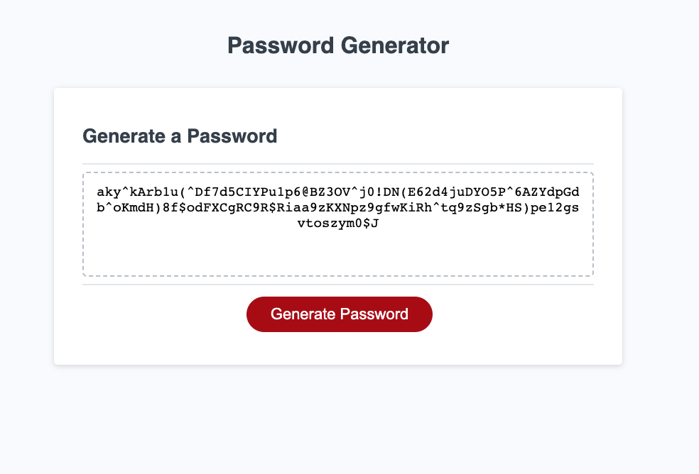

# 03 JavaScript: Password Generator

## User Story

As an employee with access to sensitive data, I want to randomly generate a password that meets certain criteria, so I can create a strong password that provides greater security

## Acceptance Criteria

* GIVEN I need a new, secure password:

* When I click the button to generate a password, I am presented with a series of prompts for password criteria
* When prompted for password criteria, I select which criteria to include in the password
* When prompted for the length of the password, I choose a length of at least 8 characters and no more than 128 characters
* When asked for character types to include in the password, I confirm whether or not to include lowercase, uppercase, numeric, and/or special characters
* When I answer each prompt, my input should be validated and at least one character type should be selected
* When all prompts are answered, a password is generated that matches the selected criteria
* When the password is generated, the password is either displayed in an alert or written to the page

## Usage

The Password Generator application displays a red button to "Generate Password". Upon entering the requirements the textbox is populated with a random valid string of characters which fit the desired requirements given.

## Mock-Up

The following image shows the web application's appearance and functionality:

## Live Demo

A Live Demo Can be Found [Here](https://julianmlacey.github.io/Password-Generator/)

## License

View "LICENSE" in Repository
